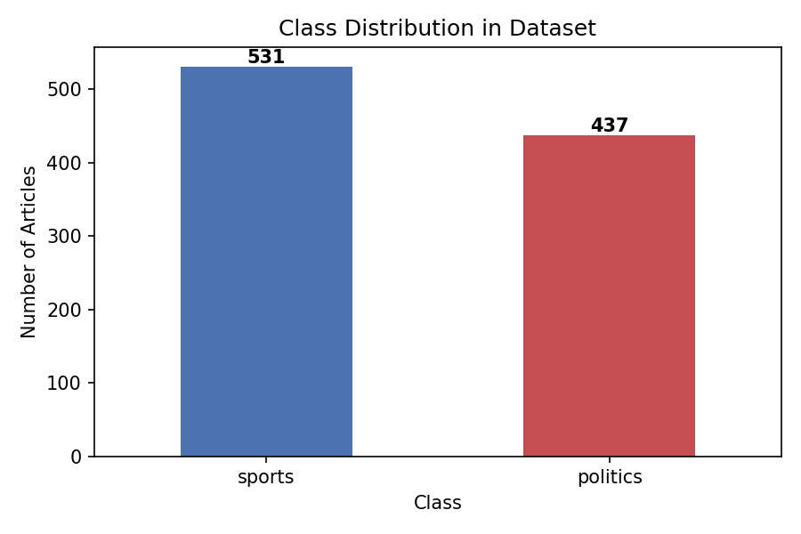
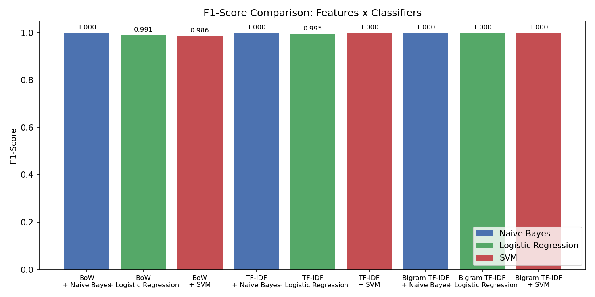
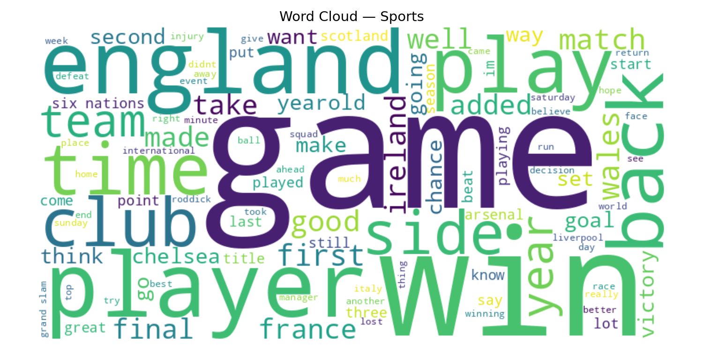
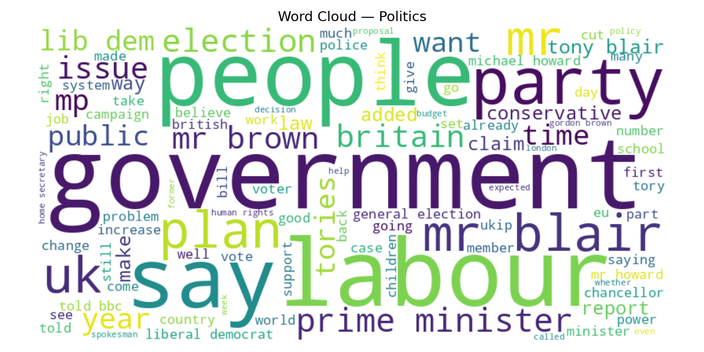
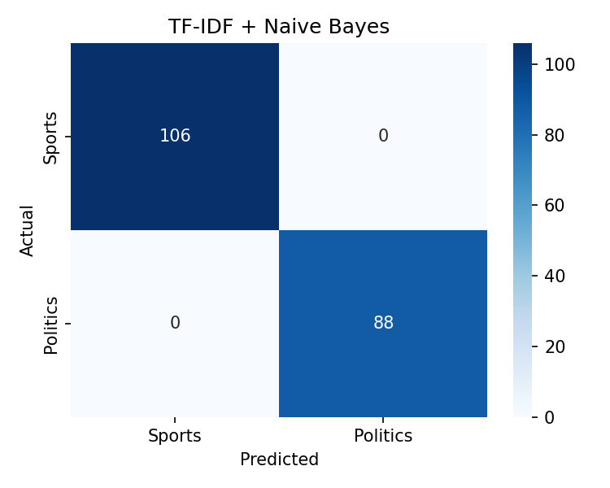
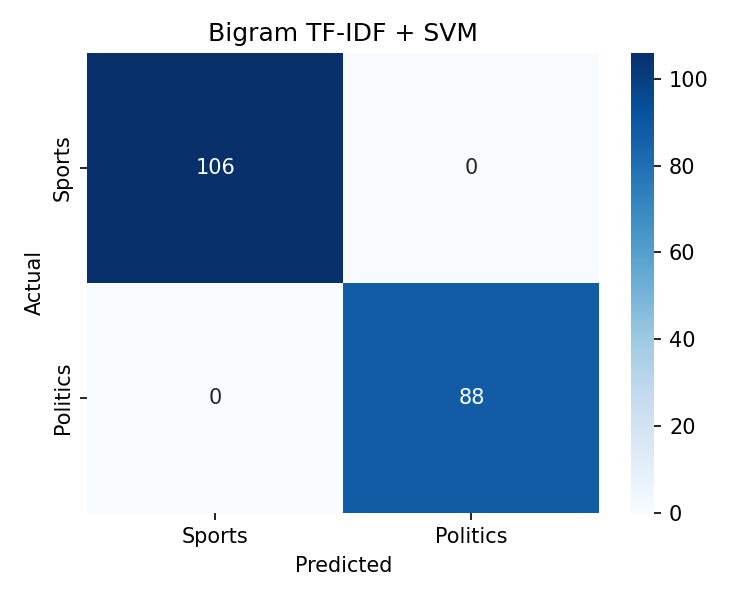

<div align="center">
  <h1>Sports vs Politics Text Classification</h1>
  <p><strong>Comparing Feature Representations and ML Classifiers for News Article Classification</strong></p>
  <p>
    <a href="https://python.org"></a>
    <a href="https://scikit-learn.org"></a>
    <a href="LICENSE"></a>
  </p>
  <p>CSL4050 &mdash; Natural Language Understanding | Assignment 1, Problem 4</p>
  <p><em>Agam Harpreet Singh (B23CM1004)</em></p>
</div>

<br/>

## Overview

A binary text classifier that distinguishes **Sports** from **Politics** news articles. We systematically compare **9 combinations** of 3 feature representations and 3 ML classifiers on a dataset of 968 articles.

> **Result:** 7 out of 9 combinations achieve **100% accuracy**. All combinations exceed **98%**.

<br/>

## Dataset

The dataset was assembled from two sources:

| Source | Sports | Politics | Total |
|:-------|:------:|:--------:|:-----:|
| [BBC News Dataset](http://mlg.ucd.ie/datasets/bbc.html) | 511 | 417 | 928 |
| Curated supplementary articles | 20 | 20 | 40 |
| **Combined** | **531** | **437** | **968** |

<p align="center">
  
</p>

<br/>

## Approach

### Preprocessing

```
Raw Text  -->  Lowercase  -->  Remove Punctuation/Numbers  -->  Remove Stopwords  -->  Clean Tokens
```

### Feature Representations

| # | Method | Description | Implementation |
|:-:|--------|-------------|----------------|
| 1 | **Bag of Words** | Raw word count vectors | `CountVectorizer(max_features=5000)` |
| 2 | **TF-IDF** | Term frequency weighted by inverse document frequency | `TfidfVectorizer(max_features=5000)` |
| 3 | **Bigram TF-IDF** | TF-IDF with unigrams + bigrams | `TfidfVectorizer(ngram_range=(1,2))` |

### Classifiers

| # | Model | Type | Implementation |
|:-:|-------|------|----------------|
| 1 | **Multinomial Naive Bayes** | Probabilistic (generative) | `MultinomialNB()` |
| 2 | **Logistic Regression** | Linear (discriminative) | `LogisticRegression(max_iter=1000)` |
| 3 | **Linear SVM** | Maximum-margin | `LinearSVC(max_iter=2000)` |

<br/>

## Results

### Performance Comparison (3 Features x 3 Classifiers = 9 Experiments)

| Feature | Classifier | Accuracy | Precision | Recall | F1-Score |
|:--------|:-----------|:--------:|:---------:|:------:|:--------:|
| BoW | Naive Bayes | **1.0000** | 1.0000 | 1.0000 | **1.0000** |
| BoW | Logistic Regression | 0.9897 | 0.9906 | 0.9906 | 0.9906 |
| BoW | SVM | 0.9845 | 0.9813 | 0.9906 | 0.9859 |
| TF-IDF | Naive Bayes | **1.0000** | 1.0000 | 1.0000 | **1.0000** |
| TF-IDF | Logistic Regression | 0.9948 | 0.9907 | 1.0000 | 0.9953 |
| TF-IDF | SVM | **1.0000** | 1.0000 | 1.0000 | **1.0000** |
| Bigram TF-IDF | Naive Bayes | **1.0000** | 1.0000 | 1.0000 | **1.0000** |
| Bigram TF-IDF | Logistic Regression | **1.0000** | 1.0000 | 1.0000 | **1.0000** |
| Bigram TF-IDF | SVM | **1.0000** | 1.0000 | 1.0000 | **1.0000** |

### F1-Score Comparison

<p align="center">
  
</p>

### Word Clouds

<table>
  <tr>
    <td align="center"><strong>Sports</strong></td>
    <td align="center"><strong>Politics</strong></td>
  </tr>
  <tr>
    <td></td>
    <td></td>
  </tr>
</table>

### Confusion Matrices

<details>
<summary><strong>Bag of Words</strong> (click to expand)</summary>
<br/>
<p align="center">
  
  
  
</p>
</details>

<details>
<summary><strong>TF-IDF</strong> (click to expand)</summary>
<br/>
<p align="center">
  
  
  
</p>
</details>

<details>
<summary><strong>Bigram TF-IDF</strong> (click to expand)</summary>
<br/>
<p align="center">
  
  
  
</p>
</details>

<br/>

## Key Findings

- **Bigram TF-IDF** is the strongest feature set -- perfect scores with all 3 classifiers
- **Naive Bayes** is the most consistent classifier -- perfect scores with all 3 feature types
- **TF-IDF weighting** helps over raw BoW by down-weighting common cross-class words
- The only errors (2-3 misclassifications) occur with **BoW + LR** and **BoW + SVM**

<br/>

## Quick Start

```bash
# clone the repo
git clone https://github.com/Agam77055/sports-vs-politics-classifier.git
cd sports-vs-politics-classifier

# install dependencies
pip install -r requirements.txt

# run the full pipeline (trains all 9 models, prints results, saves plots)
python B23CM1004_prob4.py
```

<br/>

## Project Structure

```
.
├── B23CM1004_prob4.py          # main classifier script (train, evaluate, plot)
├── collect_data.py             # data collection and assembly
├── report.tex                  # LaTeX source for the detailed report
├── requirements.txt            # Python dependencies
├── data/
│   └── dataset.csv             # 968 labelled articles (sports / politics)
├── plots/                      # all generated visualizations
│   ├── class_distribution.png
│   ├── f1_comparison.png
│   ├── wordcloud_sports.png
│   ├── wordcloud_politics.png
│   └── cm_*.png                # 9 confusion matrix heatmaps
└── results/
    └── results.csv             # metrics for all 9 experiments
```

<br/>

## References

1. D. Greene and P. Cunningham, "Practical Solutions to the Problem of Diagonal Dominance in Kernel Document Clustering," *Proc. ICML*, 2006.
2. F. Pedregosa et al., "Scikit-learn: Machine Learning in Python," *JMLR*, vol. 12, pp. 2825-2830, 2011.
3. C. Manning, P. Raghavan, and H. Schutze, *Introduction to Information Retrieval*, Cambridge University Press, 2008.

---

<p align="center">
  <sub>CSL4050 Natural Language Understanding | IIT Jodhpur | February 2026</sub>
</p>
